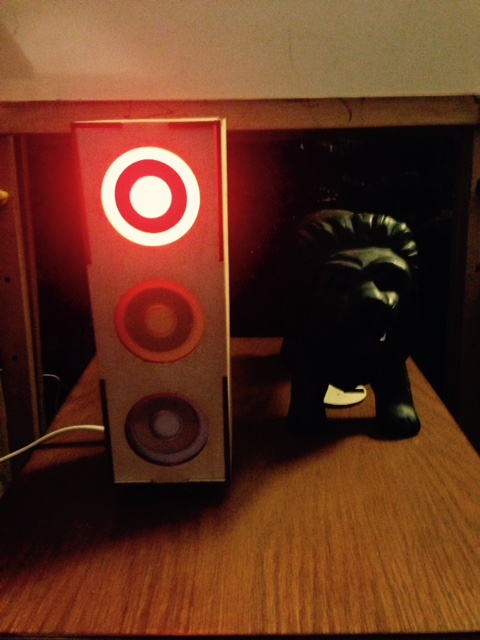
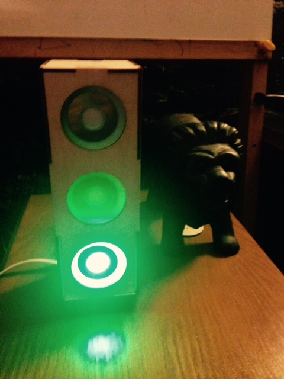

# spark-traffic-light
A traffic light showing [Jenkins](http://jenkins-ci.org/) ci system results built around a [spark.io core](https://store.spark.io/?product=spark-core).

It will automatically turn red or green after the build finishes.

The companion Jenkins plug-in can be found over in [this repo](https://github.com/moonshot/spark-traffic-plugin).
